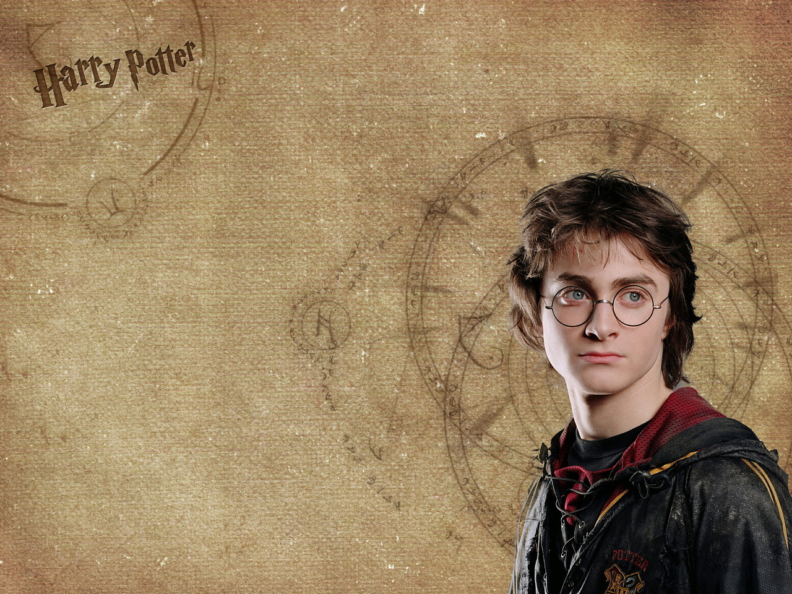
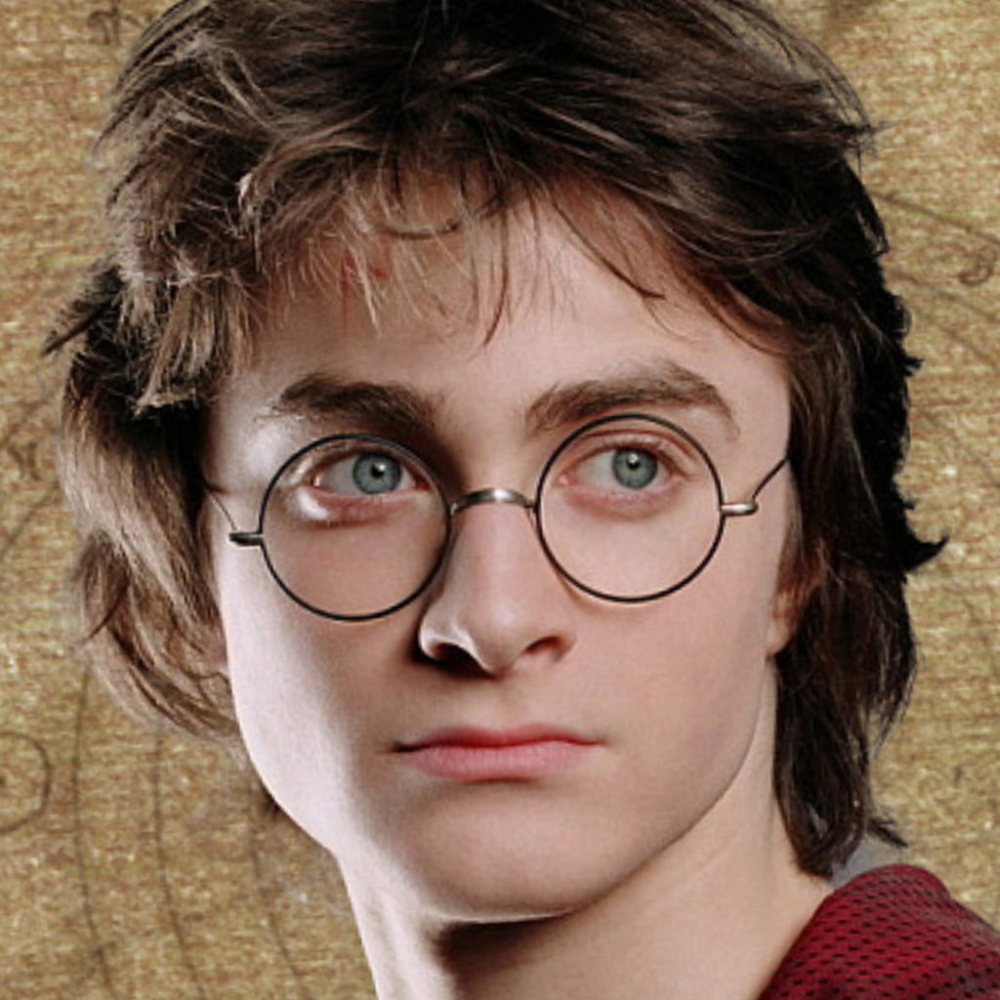

# Face Morphing


This code generates a morphing effect between two faces.		
1. Facial landmarks recognition in both faces using [Dlib](http://dlib.net).
2. Triangular [Delaunay](https://en.wikipedia.org/wiki/Delaunay_triangulation) segmentation.	
3. [Affine transformation](https://en.wikipedia.org/wiki/Affine_transformation) between the Delaunay triangles of both faces.
4. [Alpha blending](https://en.wikipedia.org/wiki/Alpha_compositing#Alpha_blending) on the paired triangles.	
> Steps 3 and 4 are iterated for different values of alpha to generate a bunch of morphing frames.		
5. After that, frames are converted into a video file using [FFmpeg](https://ffmpeg.org).

## Attributions

- Omit the neck, ear, shoulder points to make it completely automatic.
- Add the option to align and crop the images before morphing.

| Original | Modified |
|:--------:|:--------:|
|  |  |

- Find the max sharpness face in the image with multiple faces.

| Original | Find the max sharpness face |
|:--------:|:--------:|
|  |  |

## Installation dependencies

- Cause this project is running originally on MacOS, the following script installs the dependencies for MacOS.

```bash
$ ./install_morphing_dependencies_macos.sh`
```

## Morphing between 2 images

You can run the script `morphing.sh` to generate a video file with the morphing effect between two images.

```bash
$ ./run_morphing_with_images.sh <image1> <image2> <framerate> <duration_milis> [align]
```
- `image1`: initial image.	
- `image2`: final image.	
- `framerate`: frame-rate in fps.	
- `duration`: morphing duration in miliseconds.
- `align` [optional]: if set 1, the images will be aligned before morphing. Default is 0.

> I suppose you to open face alignment and cropping option for images with multiple faces to make it more robust and fluent.
> More details about parameters can be found in the script `morphing.sh` or source code.

### Example

- Unaligned version:

```bash
$ ./morphing.sh example/harry.jpg example/hermione.jpg 40 3000
```
- Aligned version:

```bash
$ ./morphing.sh example/harry.jpg example/hermione.jpg 40 3000 1
```

| unaligned | aligned |
|:--------:|:--------:|
|  |  |

## More info

You can check the Delaunay and Voronoi diagrams generated for the example images by running the code `draw_delaunay.py`.

```bash
$ python my_code/landmark_detector.py --image <img_path> # generate the landmarks file
$ python my_code/draw_delaunay.py --image <img_path> # generate the Delaunay and Voronoi diagrams
```

## References

[Face Morph Using OpenCV — C++ / Python](https://www.learnopencv.com/face-morph-using-opencv-cpp-python/)

