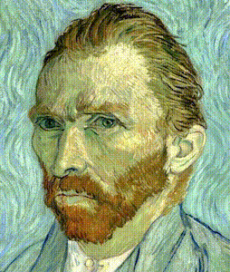

# Face Morphing



This code generates a morphing effect between two faces.		
1. Facial landmarks recognition in both faces ([Dlib](http://dlib.net)).	
2. Triangular [Delaunay](https://en.wikipedia.org/wiki/Delaunay_triangulation) segmentation.	
3. [Affine transformation](https://en.wikipedia.org/wiki/Affine_transformation) between the Delaunay triangles of both faces.
4. [Alpha blending](https://en.wikipedia.org/wiki/Alpha_compositing#Alpha_blending) on the paired triangles with a given transparency.	

Steps 3 and 4 are iterated for different values of alpha to generate a bunch of morphing frames.		
After that, frames are converted into a video file.	

## Attribution

This code is a modification of the code originally posted in this [blog post](https://www.learnopencv.com/face-morph-using-opencv-cpp-python/). For more details about this code [Face Morph Using OpenCV — C++ / Python](https://www.learnopencv.com/face-morph-using-opencv-cpp-python/).

Note that unlike the original code, only the corners and half way points are added to the facial keypoints.	
The neck and the ears points manually added in the original code have been omitted to make it completely automatic.

## Installation dependencies for macOS and Ubuntu

Run the proper script or install each therein included library for your OS `macos` or `ubuntu`.	 Python 2 required.	
```bash
$ ./install/install_morphing_dependencies_<myOS>.sh`
```

## How to morph between 2 images

The following script runs the entire pipeline.

```bash
$./run_morphing_with_images.sh <image1> <image2> <framerate> <duration_milis>
```
`image1`: initial image.	
`image2`: final image.	
`framerate`: frame-rate in fps.	
`duration`: morphing duration in miliseconds.

### Example

```bash
$./morphing.sh ./example/van_gogh.png ./example/paul_goughin.png 30 2000
```

## How to create caricatures

Make landmarks from the first face stay for every morphing iteration.	
That will transfer the facial expression from one face to the other.	
There are cleaner ways to do it, but a simple one is to comment the line below where landmarks are refreshed.

```python
for (f, a) in enumerate(np.linspace(0,100,n_frames)) :
	# some code here
	# points = []	    # Comment this line to get a cartoon effect          
```

Order 2 frames if you just like to have the cartoon frame:	

```bash
$./morphing.sh <image1> <image2> 2 1000
```

## How to create a loop-back effect

Just make `alpha` range double and then decrease it when exceeds 1.

```python
for (f, a) in enumerate(np.linspace(0,100,n_frames)) :
    alpha = float(a) / 100	# 0 to 1
    alpha = 2 * alpha
    if alpha > 1 :  alpha = 2 - alpha    
```

## Limitations

Although *Dlib* is quite robust in most cases, it has its own limitations for detecting facial landmarks.	
In case that the nose and eyes are not enough visible, face detection may fail.
It also will fail on detecting non-real faces for instance cartoons, even if they have eyes, nose and mouth.

## References

- [Face Morph Using OpenCV — C++ / Python](https://www.learnopencv.com/face-morph-using-opencv-cpp-python/)
    - [Source code](https://github.com/spmallick/learnopencv/tree/master)